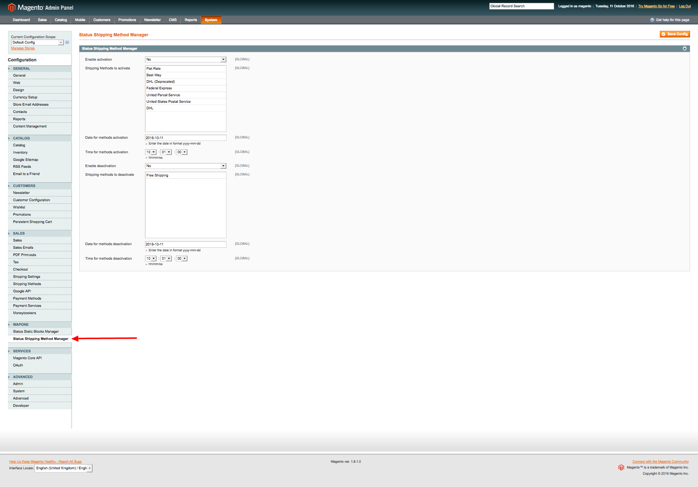

# WaPoNe_StatusShippingMethodManager
A Magento extension to schedule shipping methods enabling/disabling

##Installation

1. Login into the backend, go to System — Cache Management and enable all types of cache.
2. Go to System — Tools — Compilation and make sure compilation is disabled.
3. Connect to your website source folder with FTP/SFTP/SSH and upload all the extension files and folders from “Step1” folder of the extension package to the root folder of your Magento installation.
Please use the “Merge” upload mode. Do not replace the whole folders, but merge them. This way your FTP/SFTP client will only add new files.
4. Upload all the extension files and folders from “Step2” folder the same way you did in the previous step.
5. Go to System — Cache Management page under Magento backend and click “Flush Cache Storage” button. After this action, the extension is installed.
6. If you need to enable compilation, you can do it now at System — Tools — Compilation.
7. Please log out of the backend and log in again, so Magento can refresh permissions.

## User Guide

### Enabling methods

1. Go to System - Configuration - WaPoNe - Status Shipping Method Manager.

2. Set to 'Yes' *Enabling* field if you want to enable shipping methods.
3. Select shipping methods to enable.
4. Enter the date and the time when script has to start (cron job *wapone_status_shipping_manage* runs every five minutes by default).

### Disabling methods

1. Go to System - Configuration - WaPoNe - Status Shipping Method Manager.
2. Set to 'Yes' *Disabling* field if you want to disable shipping methods.
3. Select shipping methods to disable.
4. Enter the date and the time when script has to start (cron job *wapone_status_shipping_manage* runs every five minutes by default).

**After script was executed, _Enabling/Disabling_ field will set to 'No' to avoid it is execute more times**

## Compability

- Magento CE:
  - 1.8.x
  - 1.9.x
